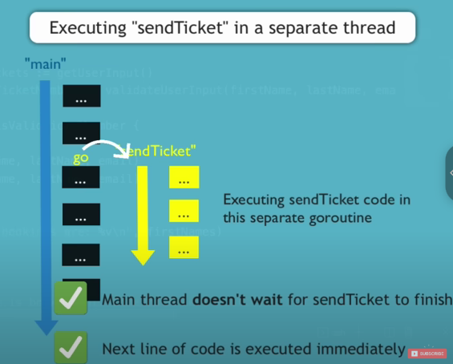
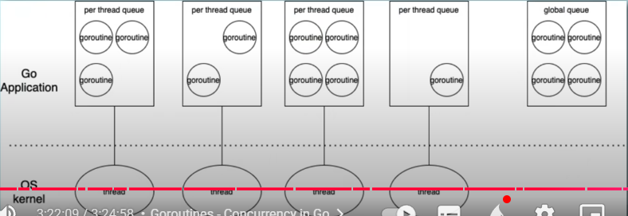
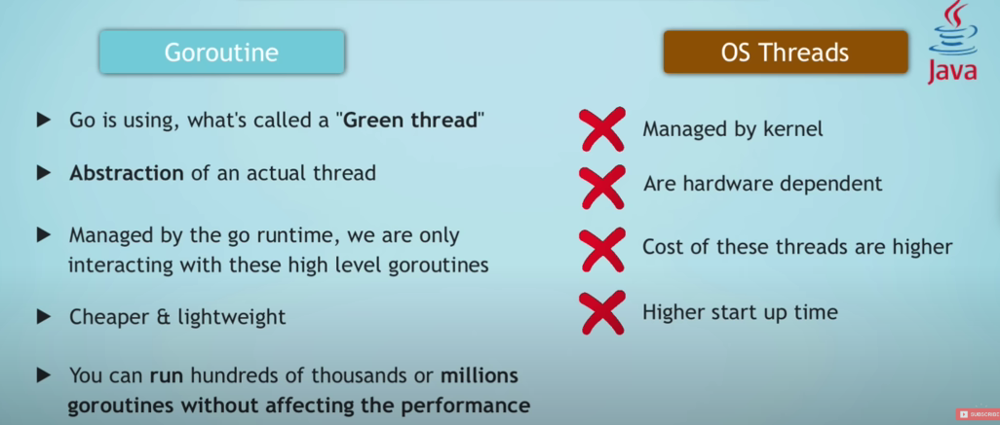
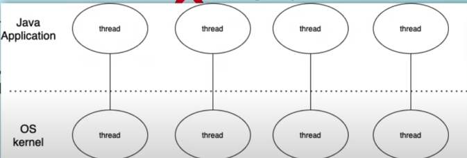

# GOLANG

### Đặc điểm
- `Go` được thiết kế để chạy trên **multiple cores** và xây dựng để hỗ trợ **concurrency**.
- `Concurrency của Go` có chi phí rẻ và dễ dàng.
- `Go` được sử dụng viết các `performant applications`
- Các ứng dụng chạy trên `scaled, distributed systems` như là có hàng ngàn server, cloud platform.
- `Go` kết hợp giữa systax đơn giản và dễ đọc như Python với effiency và safety của ngôn ngữ bậc trung như C++.
- Tiết kiệm tài nguyên hệ thống.
- Code được compiled thành machine code nên tốt hơn ác ngôn ngữ thông dịch như python phải chạy từng dòng, khi chương trình chạy thì máy tính sẽ thực thi trực tiếp mã máy, không cần xử lí trung gian còn thông dịch thì phải chạy từng dòng, gây tốn tài nguyên và thời gian.
- Consistent giữa các hệ điều hành.
- IDE : Visual Studio Code
- Go compiler
- Extensions: go,

- Tạo file go.mod: mô tả về module path, version, module path có thể là một import path
```sh
go mod init booking-app
```
- Tất cả code thuộc về package
- First statement in Go file là package ...
- Entry point: chỉ có một main func
- `fmt` : Format package
- Go được tổ chức thành những package (tập hợp nhiều source files)
```go
func main()
```

- Chạy code
```sh
go run main.go
```

### Variables & Constant
25 keywords
- variables, packages phải được sử dụng, không thì compiler sẽ báo lỗi.
- constant: giá trị không được thay đổi

```sh
var conferenceName string = "GopherCon" #variable
const conferenceTickets = 50 #constant
```

#### Formatting Output
```golang
    var conferenceName string = "GopherCon"
	const conferenceTickets = 50
	var remainingTickets = 50
	fmt.Printf("Welcome to %v booking application\n", conferenceName)
	fmt.Println("Welcome to", conferenceName)
	fmt.Printf("Number of tickets left: %v and number of tickets remaining%v\n", conferenceTickets, remainingTickets)
	fmt.Println("Number of tickets remaining:", remainingTickets)

    //%v: value, %T : type
```
#### Data types
- phải khai báo với go compiler, có thể không khai báo bằng cách cung cấp giá trị
- int8, int16, int32, int64, uint8, 16, 32, 64
```go
    //os.Stdin là một đối tượng kiểu *os.File đại diện cho đầu vào tiêu chuẩn (standard input - stdin) của hệ thống.
	//Nó được sử dụng để nhận dữ liệu nhập từ bàn phím hoặc từ một file/kênh nhập khác. 
	reader := bufio.NewReader(os.Stdin)
	scanner := bufio.NewScanner(os.Stdin)

	var lastName string = "Nhân"
	const middleName string = "Ngọc"
	var numberTicket int = 1
	firstName := "Trần" // một cách gán giá trị kiểu khác
	
	var fullName string
	// fmt.Scanln(&fullName)

	fmt.Println("Nhập nhiều dòng (ấn Enter trên dòng trống để dừng):")
	var description string
	for scanner.Scan(){
		line := scanner.Text();
		if line == ""{
			break
		}
		description += line + "\n"
	}
	//nhập một dòng
	fullName, _ = reader.ReadString('\r') // \n
	fmt.Println(fullName)
	fmt.Printf("%T\n", numberTicket)
	fmt.Printf("%v %v %v",firstName, middleName, lastName)
```
#### logic
```go
    var a = 5
	a %= 5
	a--
	a -= 51
```
#### array
```go
    // var variable_name [length]type
	var numbers = [50]int{1,23,4} // var numbers [50]int
	numbers[2] = 3
	length := len(numbers)
	fmt.Println(numbers)
	fmt.Println(length)
	//get type of array
	fmt.Printf("%T\n", numbers)
```

#### slices
- không cần chỉ định size
- index, resize khi cần thiết
```go
    //var numbers []int
	//var numbers = []int{}
	numbers := []int{}

	numbers = append(numbers, 1)

	fmt.Println(numbers)
	fmt.Printf("%v\n", numbers)
```

#### Loop
- Chỉ có for loop
- range
- strings.Fields(): tách chuỗi với white space và return slices
```go
	s := []string{}
	names := []string{"Tran Ngoc Nhan", "Cao Tien Minh"}
	for _, name := range names{
		var splitName = strings.Fields(name)
		s = append(s, splitName[0])
	}
	for i := 0; i < 5; i++{
		fmt.Println(i)
	}
	fmt.Println(s)
```

#### conditional
- break, continue
- switch không cần break
- !=, ==, <=,...
```go
num := 10
	var check bool = num == 10
	fmt.Println(check)

	for true{
		fmt.Scanln(&num)
		if num > 10 && num < 20{
			fmt.Println("You got it!")
			break
		}else if num < 10{
			fmt.Println("Try again1!")
		}else{
			fmt.Println("Try again2!")
		}
	}
	if strings.Contains("Hello World", "Hello"){
		fmt.Println("Found!")
	}
	country := "Vietnam"
	fmt.Scanln(&country)
	fmt.Println(country)
	switch country{
	case "Vietnam", "vietnam", "Viet Nam":
		fmt.Println("Hanoi")
	case "USA":
		fmt.Println("Washington")
	default:// nếu country không trùng với các case trên thì sẽ chạy vào đây
		fmt.Println("Not found!")
	}
```


#### Function
- Có thể trả về nhiều giá trị
- Package level variable: dùng từ khóa var, const, không dùng :=, biến chỉ dùng trong package, nếu bắt đầu bằng chữ hoa thì có thể truy cập bên ngoài package,
có thể khai báo nhiều biến cùng  1 lúc
- biến và hàm định nghĩa bên ngoài hàm thì có thể truy ở tất cả các file trong cùng một package
```go
var (
	x int
	y string
	z bool
)
```
#### Packages in Go
- 1 package: collection go files
```sh
go run main.go helper.go
go run . # chạy tất cả các file trong folder hiện tại
```
- nhiều package
	- export để dùng được, ở package khác
	- viết hoa chữ cái đầu để export
	- có thể export biến, function, types,...
```go

```
- 3 levels của biến
	- local: trong function
	- package: sử dụng trong cùng 1 package
	- global: sử dụng toàn bộ package


#### map

```go
	mymap := map[string]int{"key3" : 3, "key4" : 4}
	//mymap := make(map[string]int, 7)
	mymap["key1"] = 1
	mymap["key2"] = 2

	for key, _ := range mymap {
		println(mymap[key])
	}

	s := strconv.FormatUint(42, 16)
	fmt.Println(s)
```


#### struct
- type keyword tạo ra một kiểu mới với tên chỉ định
- giống như class, mà không thể kế thừa
```go
	type Person struct{
	firstName string
	lastName string
	email string
	age int
}


func main(){
	person1 := Person{
		firstName: "Tran Ngoc",
		lastName: "Nhan",
		email: "nhan@gmail.com",
		age: 20,
	}
	person1.age = 21
	fmt.Println(person1)
}
```

#### concurrency

- task sẽ được chạy ở 1 thread mới
- "go" keyword bắt đầu một goroutine
- 1 goroutine là 1 **lightweight thread** được quản lý bởi go runtime
- mặc định main goroutine không đợi các goroutine khác

- Cần waitgroup, đợi các launched goroutine hoàn thành, cần package "sync"
- done function: xóa những thread
- so sánh với java: viết concurrent code phức tạp hơn, more overhead, creating mắc, slow startup time, nặng, cần nhiều phần cứng.
- go: 'green thread' là một abstraction của một thread thực sự
- không dễ dàng các thread nói chuyện với nhau như java, cò ở go thì dễ dàng nhờ channels



